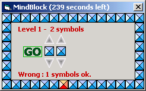



## MindBlock

### Description

With this game you must find all the combinations of symbols before the time finish. You will start with 2 simbols and finish with 7. Cool (but silly :) ). Enjoy.
 
### More Info
 

             |
---                |---
**Submitted On**   |2001-12-22 15:54:10
**By**             |[Sebastiano Pallaro](https://github.com/Planet-Source-Code/PSCIndex/blob/master/ByAuthor/sebastiano-pallaro.md)
**Level**          |Beginner
**User Rating**    |4.7 (14 globes from 3 users)
**Compatibility**  |VB 4\.0 \(32\-bit\), VB 5\.0, VB 6\.0
**Category**       |[Games](https://github.com/Planet-Source-Code/PSCIndex/blob/master/ByCategory/games__1-38.md)
**World**          |[Visual Basic](https://github.com/Planet-Source-Code/PSCIndex/blob/master/ByWorld/visual-basic.md)
**Archive File**   |[MindBlock53743272002\.zip](https://github.com/Planet-Source-Code/sebastiano-pallaro-mindblock__1-31585/archive/master.zip)

